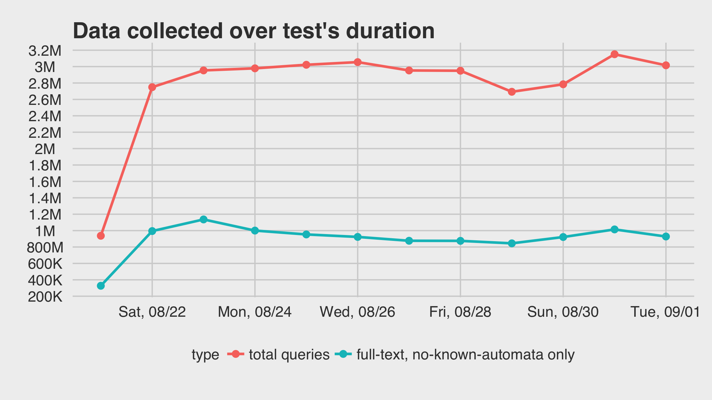
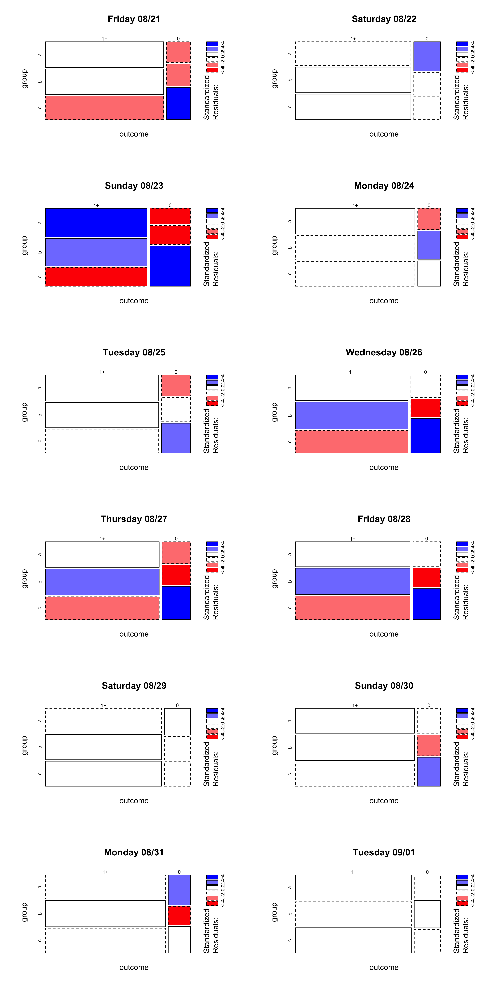
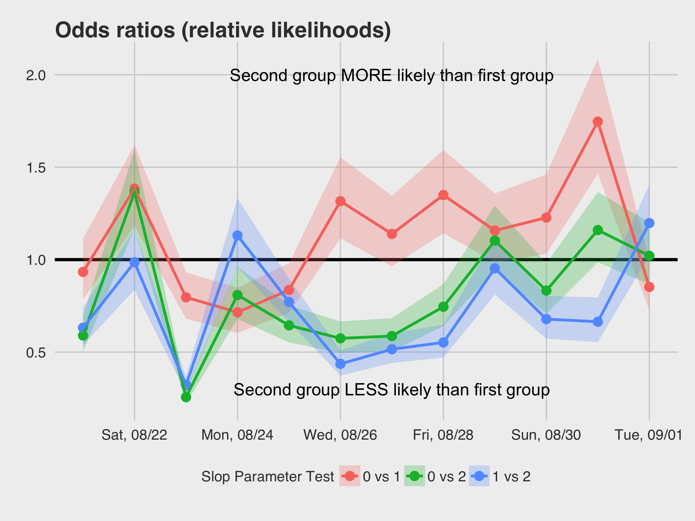

```{r setup, include = FALSE}
knitr::opts_chunk$set(warning = FALSE, message = FALSE, error = FALSE, echo = FALSE)
```

```{r prereq, include = FALSE}
library(magrittr)
```

## Background

The **slop** parameter indicates how far apart terms are allowed to be while still considering the document a match. __*Far apart*__ means: *how many times do you need to move a term in order to make the query and document match?*

## Methods

We sampled 3% of the total queries over the course of 12 days.

- 1% of the total queries did not receive a change; they were the control group "A".
- 1% of the total queries were assigned a slop parameter of 1 to their queries; they were the experimental group "B".
- 1% of the total queries were assigned a slop parameter of 2 to their queries; they were the experimental group "C".

Even with 1% sampling rate, the final sample sizes were huge. Were we to perform our analyses on the full collected dataset, we would have seen significance for the tiniest effects. Instead, we chose to perform an a priori-style power analysis post-hoc. Which is to say, we calculated our sample sizes as one would before beginning the experiment, and then sampled down (using random sampling stratified on group to obtain equally-sized groups) to obtain a smaller dataset. A more detailed description of the power analysis follows.

### Power Analysis

From the preliminary analysis of the data from the morning of the test's launch, 84.2% of the control group were getting some results. This is the "prevalence within control group" that we used for this power analysis.

We also wanted to be able to detect an odds ratio of at least 1.5. That is, if the slop parameter does have an impact on the search results then the test group being 1.5 times more likely to get results than the control group is the smallest impact we'd be satisfied with.

We decided on 99% power to detect this effect and an $\alpha$ level of 0.05.

```{r sample_size_calc, echo = TRUE, eval = FALSE}
wmf::sample_size_odds(odds_ratio = 1.5, p_control = 0.8423662,
                      power = 0.99, conf_level = 0.95,
                      sample_ratio = 1) # => 3950 => 4000
```

After removing known automata and nonsensical queries (e.g. queries to the donation website), we randomly sampled each day's big dataset down to a smaller dataset of just 6000 observations -- 2000 for each of the 3 groups, so that each of the two tests comparing controls to a test group had 4000 observations evenly split.

### Statistical Analysis

The large sample sizes were sufficient for us to perform Chi-squared tests of independence between the group (slop parameter) and outcome (none vs some results).

## Results



The number of full-text queries varies according to an established pattern of user activity throughout the week, particularly of the mobile users who are most active on Sundays.

\newpage

### Breakdown of groups in top projects

|project                  | total|a      |b       |c       |
|:------------------------|-----:|:------|:-------|:-------|
|**commons**              |   966|76.40% |10.35%  |13.25%  |
|mediawiki                |    10|40.00% |30.00%  |30.00%  |
|simple wikipedia         |    46|19.57% |43.48%  |36.96%  |
|wikibooks                |    50|30.00% |44.00%  |26.00%  |
|wikidata                 |  3026|22.97% |25.08%  |51.95%  |
|wikipedia                | 66949|33.53% |34.11%  |32.36%  |
|wikiquote                |    46|15.22% |52.17%  |32.61%  |
|wikisource               |    44|36.36% |47.73%  |15.91%  |
|wikiversity              |     9|44.44% |33.33%  |22.22%  |
|wikivoyage               |    14|28.57% |42.86%  |28.57%  |
|**wiktionary**           |   810|7.41%  |23.21%  |69.38%  |

These numbers reflect full-text, no-known-automata queries after sampling down. The only really problematic (read: disproportionately sampled queries) projects are **Commons** and **Wiktionary**. We reflect on this in the **Discussion**.

### Statistical Tests of Association

```{r load_stats, include = FALSE}
load("statistics/group_outcome_comparisons.RData")
```

In the figure below, we saw suggestions of association. Some groups had better or worse outcomes than we would have expected them under the assumption of independence. Group C, for example, almost consistently had MORE zero results (denoted by blue), while groups A and B had less (denoted by red). We performed Chi-squared tests of independence on each of the days and found evidence of statistically significant association between group membership and outcome:

```{r stats_AvsBvsC, results = 'asis'}
stats_AvsBvsC %>%
  cbind(Date = as.character(log_dates, format = "%A %m/%d")) %>%
  dplyr::select(-`Chi-square Statistic`) %>%
  dplyr::select(c(`Date`, `p-value`, `Cohen's w`)) %>%
  dplyr::mutate(`p-value` = ifelse(`p-value` < 0.001, "< 0.001", round(`p-value`, 3))) %>%
  knitr::kable(digits = 3)
```

Next, we looked into the strength and the direction of the relationships.

\newpage



\newpage

### Sub-tests of Association



Overall, with the exception of a couple of days, the group with slop parameter of 1 was more likely to get nonzero results than the controls. The group with the slop parameter of 2, on the other hand, was significantly LESS likely to get nonzero results! In fact, on one of the days group C was actually 1/4 times less likely to get nonzero results, or to put it another way: 4 times more likely than to get zero results.

The numbers from the tests are provided in greater detail in the **Appendix**.

\newpage

## Conclusion

We have shown here that changing slop parameter from 0 to 1 yields significantly less zero results across some of the days this experiment was active. There were also a few days when the effect was significantly negative. Only once was group B more than 1.5 times more likely than group A to get nonzero results.

Group C, however, had the worst experience. Group C was less likely than A to get nonzero results and even less likelier than group B. This fundamentally contradicts our understanding of search -- how could we give our users LESS results by being LESS restrictive with phrase matching?

But we set a goal for ourselves: positive impact is at least 1.5 times, and the overall results do not suggest that changing the slop parameter from 0 to 1 gives us that impact. Therefore, we do not recommend switching from slop parameter of 0 to a slop parameter of 1. The results, while positive and nearly-but-not-quite up to our standards on some days, are not overwhelmingly convincing that switching is the way to go.

## Discussion

We improved a lot from our first A/B test in terms of how we design and conduct our experiments. The addition of power analysis prior to performing any statistical analyses was a wise decision, a trend we hope to establish going forward.

We recommend investigating the cause for the disproportionate sampling within **Commons** and **Wiktionary**. We originally noticed this when we did the Initial Analysis ([PDF](https://github.com/wikimedia-research/PhraseSlopSwap/blob/master/initial_analysis/notebook.pdf)) and thought that perhaps the changes haven't had time to propagate to those servers. That we see the same sampling biases in the final dataset suggests a need to conduct an investigation.

Additionally, we recommend further research into the discrepancy between what we logically expect the results to be versus what the results actually are. We should not be seeing overwhelemingly worse outcomes with less restrictive matching parameters.

## References

* Elasticsearch: The Definitive Guide » Search in Depth » Proximity Matching » [Mixing It Up](https://www.elastic.co/guide/en/elasticsearch/guide/current/slop.html)

\newpage

# Appendix

Final dataset after grooming. These numbers reflect the pre-downsampling dataset.

|project                  |    total|a      |b      |c       |
|:------------------------|--------:|:------|:------|:-------|
|beta wikiversity         |       24|12.50% |70.83% |16.67%  |
|commons                  |   107305|70.22% |12.32% |17.46%  |
|foundation wiki          |     1245|31.00% |35.98% |33.01%  |
|mediawiki                |     1158|27.55% |35.15% |37.31%  |
|meta wiki                |      642|33.64% |33.49% |32.87%  |
|office wiki              |        6|0.00%  |0.00%  |100.00% |
|outreach wiki            |       19|15.79% |73.68% |10.53%  |
|simple wikipedia         |     6295|33.57% |33.07% |33.36%  |
|simple wikipediabooks    |       15|0.00%  |93.33% |6.67%   |
|simple wikipediaquote    |       19|10.53% |89.47% |0.00%   |
|simple wiktionary        |      111|31.53% |33.33% |35.14%  |
|wikibooks                |     7024|25.63% |49.29% |25.09%  |
|wikidata                 |   411061|26.35% |24.64% |49.01%  |
|wikimedia                |      523|11.09% |76.48% |12.43%  |
|wikimedia incubator wiki |      655|30.53% |36.18% |33.28%  |
|wikinews                 |     1400|21.79% |55.21% |23.00%  |
|wikipedia                | 10120053|37.11% |30.46% |32.43%  |
|wikiquote                |     7792|28.09% |42.22% |29.68%  |
|wikisource               |     4338|24.87% |49.26% |25.86%  |
|wikispecies              |      278|33.45% |29.14% |37.41%  |
|wikiversity              |     1178|30.14% |44.48% |25.38%  |
|wikivoyage               |     1285|24.82% |47.16% |28.02%  |
|wiktionary               |   122400|7.88%  |21.36% |70.77%  |

**Note**: We excluded "be_x_old wiki", "donation site", and "testwikidata" from the analysis.

\newpage

## Slop 0 vs Slop 1

```{r stats_AvsB, results = 'asis'}
stats_AvsB %>%
  cbind(Date = as.character(log_dates, format = "%A %m/%d")) %>%
  dplyr::select(-`Chi-square Statistic`) %>%
  dplyr::rename(`More or less likely than controls?` = summary) %>%
  dplyr::mutate(`Odds Ratio 95% CI` = sprintf("(%.3f, %.3f)" ,Lower, Upper),
                `p-value` = ifelse(`p-value` < 0.001, "< 0.001", round(`p-value`, 3))) %>%
  dplyr::select(-c(Lower, Upper)) %>%
  dplyr::select(c(`Date`, `p-value`, `Cohen's w`, `Odds Ratio`, `Odds Ratio 95% CI`,
                  `More or less likely than controls?`)) %>%
  knitr::kable(digits = 2)
```

## Slop 0 vs Slop 2

```{r stats_AvsC, results = 'asis'}
stats_AvsC %>%
  cbind(Date = as.character(log_dates, format = "%A %m/%d")) %>%
  dplyr::select(-`Chi-square Statistic`) %>%
  dplyr::rename(`More or less likely than controls?` = summary) %>%
  dplyr::mutate(`Odds Ratio 95% CI` = sprintf("(%.3f, %.3f)" ,Lower, Upper),
                `p-value` = ifelse(`p-value` < 0.001, "< 0.001", round(`p-value`, 3))) %>%
  dplyr::select(-c(Lower, Upper)) %>%
  dplyr::select(c(`Date`, `p-value`, `Cohen's w`, `Odds Ratio`, `Odds Ratio 95% CI`,
                  `More or less likely than controls?`)) %>%
  knitr::kable(digits = 2)
```

## Slop 1 vs Slop 2

```{r stats_BvsC, results = 'asis'}
stats_BvsC %>%
  cbind(Date = as.character(log_dates, format = "%A %m/%d")) %>%
  dplyr::select(-`Chi-square Statistic`) %>%
  dplyr::rename(`Slop 2 more or less likely than Slop 1?` = summary) %>%
  dplyr::mutate(`Odds Ratio 95% CI` = sprintf("(%.3f, %.3f)" ,Lower, Upper),
                `p-value` = ifelse(`p-value` < 0.001, "< 0.001", round(`p-value`, 3))) %>%
  dplyr::select(-c(Lower, Upper)) %>%
  dplyr::select(c(`Date`, `p-value`, `Cohen's w`, `Odds Ratio`, `Odds Ratio 95% CI`,
                  `Slop 2 more or less likely than Slop 1?`)) %>%
  knitr::kable(digits = 2)
```
