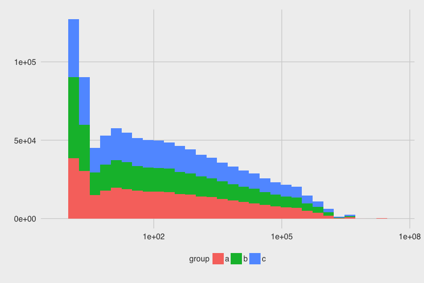
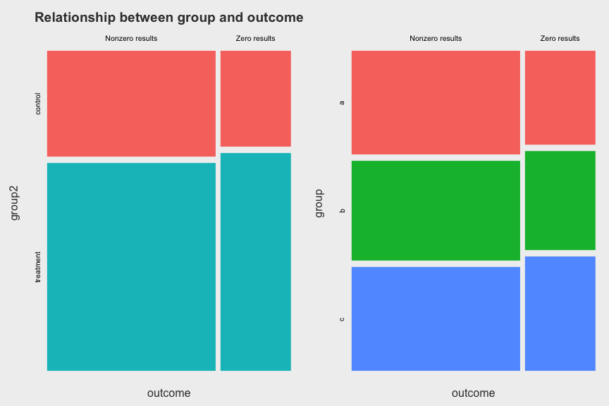
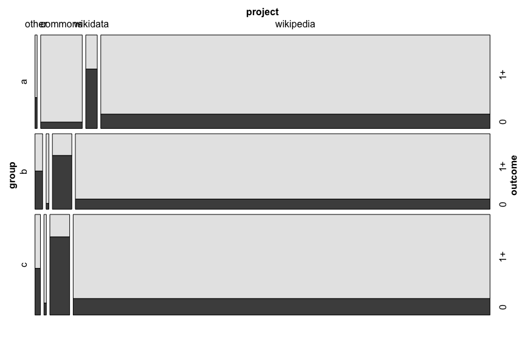
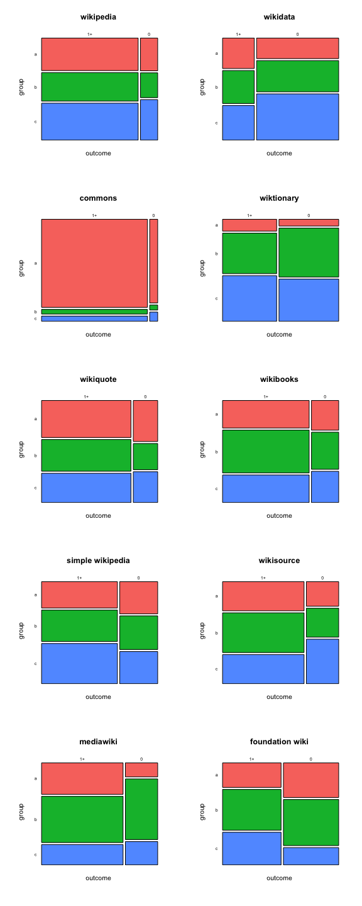
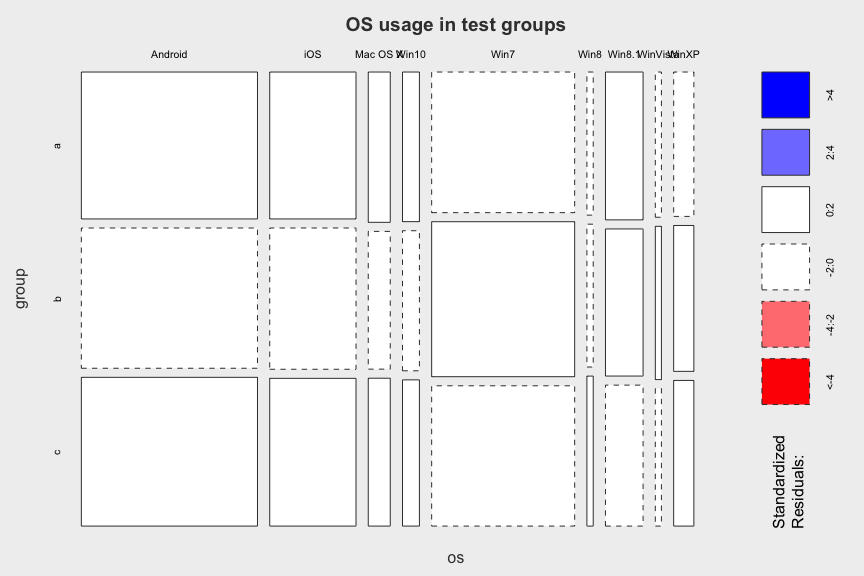
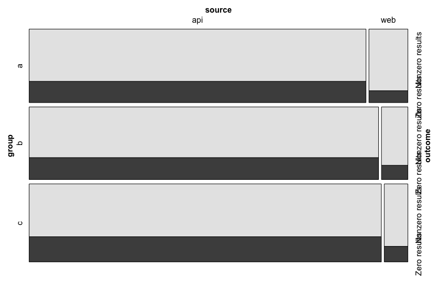

# Initial analysis of second A/B test
Mikhail Popov  
August 21, 2015  


## Data

The dataset was acquired by Mikhail on Friday, **August 21st, at 1:15PM**, holding a morning's worth of data (1,492,744 observations). The data was processed by Mikhail using **magrittr**, **dplyr**, **rgeolocate**, **uaparser**. Statistical analysis is done with certain functions provided by the **mosaic** and **vcd** packages.


## Exploratory Data Analysis (EDA)


 

 


 

What we're seeing is that the control group (slop 0) is getting MORE nonzero results and LESS zero results than expected under independence.

### Sampling Bias Assessments

 


 

In general, we see an even split in browsers and operating systems among the test groups. The plot of standardized residuals does not show significant deviations from expected values (under independence), so we are not seeing a bias.

## Statistical Analysis of Association


The test for independence yielided *p*-value < 0.001, which means we see sufficient evidence for association. <!-- The effect size is 0.037 which is very tiny (0.1 is considered small in literature).-->Next, we are going to take a look at the odds ratio, which will provide us with a measure of the strength and direction of the association.


          Odds Ratio   95% CI Lower Bound   Upper Bound
-------  -----------  -------------------  ------------
a vs b          0.91                 0.91          0.92
a vs c          0.82                 0.82          0.83
b vs c          0.90                 0.89          0.91

In all of these the second group was less likely to get non-zero results than the first group (odds ratios and their 95% confidence intervals are less than 1). This is consistent with what we saw in the mosaic plot, where **c** had more zero results than **b** which had more zero results than **a**.

### Quotes vs No-quotes

Thursday morning queries do not appear to feature quotes.


### Prefix vs Full-text


```
##             full_text_query
## prefix_query  FALSE   TRUE
##        FALSE 102230 330474
##        TRUE  898077 161963
```

 

### By Project


 

```
##                       project  other commons wikidata wikipedia
## group outcome                                                  
## a     Nonzero results           4722   16286     1611    332534
##       Zero results              2893    2550     2855    126196
## b     Nonzero results           5431    1971     1745    332510
##       Zero results              3623    1777     4305    132047
## c     Nonzero results           5197    2158     1833    346707
##       Zero results              3439    1627     6359    152368
```

Interesting! Very, very interesting.


                               a      b      c
-------------------------  -----  -----  -----
be_x_old wiki               0.38   0.27   0.35
beta wikiversity            0.00   0.00   1.00
commons                     0.71   0.14   0.14
donation site               0.00   0.00   1.00
foundation wiki             0.22   0.42   0.36
mediawiki                   0.41   0.26   0.33
meta wiki                   0.28   0.58   0.14
office wiki                 0.14   0.00   0.86
outreach wiki               0.00   0.00   1.00
simple wikipedia            0.21   0.32   0.48
simple wiktionary           0.40   0.60   0.00
testwikidata                0.33   0.67   0.00
wikibooks                   0.30   0.31   0.39
wikidata                    0.24   0.32   0.44
wikimedia                   0.43   0.17   0.40
wikimedia incubator wiki    0.21   0.39   0.40
wikinews                    0.32   0.35   0.34
wikipedia                   0.32   0.33   0.35
wikiquote                   0.33   0.37   0.30
wikisource                  0.36   0.36   0.29
wikispecies                 0.36   0.33   0.31
wikiversity                 0.37   0.36   0.27
wikivoyage                  0.25   0.19   0.55
wiktionary                  0.30   0.36   0.34


### By Language


### By Source

 

### Linear Trend Assessment...


With such a large M2...

## Statistical Analysis of Time Taken

hist(data$time_taken)
