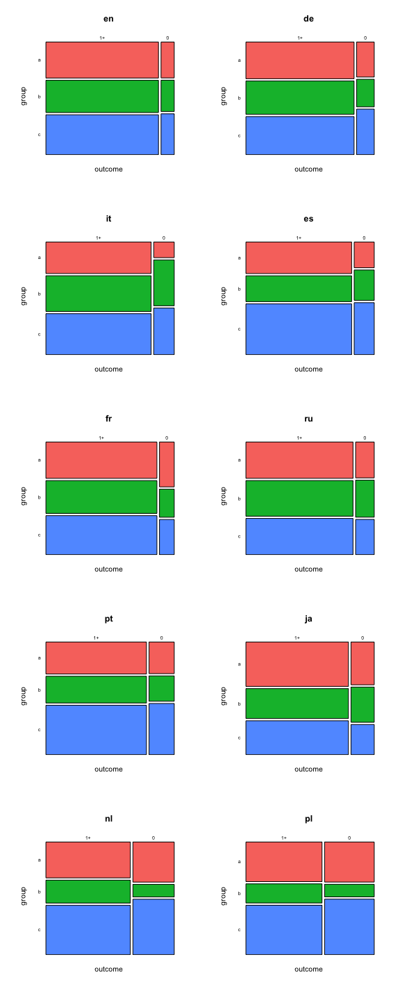

# Initial analysis of second A/B test
Mikhail Popov  
August 21, 2015  

## Data

The dataset was acquired by Mikhail on Friday, **August 21st, at 1:15PM**, holding a morning's worth of data (1,492,744 observations). The data was processed by Mikhail using **magrittr**, **dplyr**, **rgeolocate**, **uaparser**. Statistical analysis is done with certain functions provided by the **mosaic** and **vcd** packages.

## Exploratory Data Analysis (EDA)

 

 

 

What we're seeing is that the control group (slop 0) is getting MORE nonzero results and LESS zero results than expected under independence.

### Sampling Bias Assessments

 

 

In general, we see an even split in browsers and operating systems among the test groups. The plot of standardized residuals does not show significant deviations from expected values (under independence), so we are not seeing a bias.

### Initial Assessments

## Statistical Analysis

The test for independence yielided *p*-value < 0.001, which means we see sufficient evidence for association. <!-- The effect size is 0.037 which is very tiny (0.1 is considered small in literature).-->Next, we are going to take a look at the odds ratio, which will provide us with a measure of the strength and direction of the association.

|       | Odds Ratio| 95% CI Lower Bound| Upper Bound|
|:------|----------:|------------------:|-----------:|
|a vs b |       0.91|               0.90|        0.92|
|a vs c |       0.82|               0.82|        0.83|
|b vs c |       0.90|               0.89|        0.91|

In all of these the second group was less likely to get non-zero results than the first group (odds ratios and their 95% confidence intervals are less than 1). This is consistent with what we saw in the mosaic plot, where **c** had more zero results than **b** which had more zero results than **a**.

## Linear Trend Assessment...

With such a large M2...
