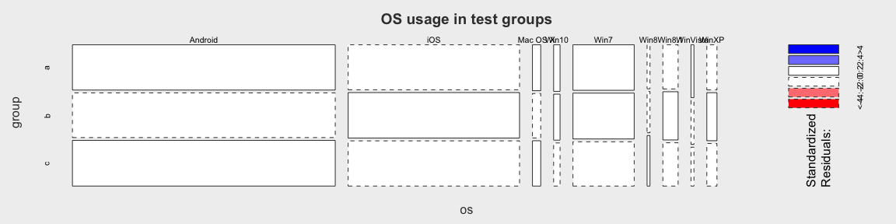
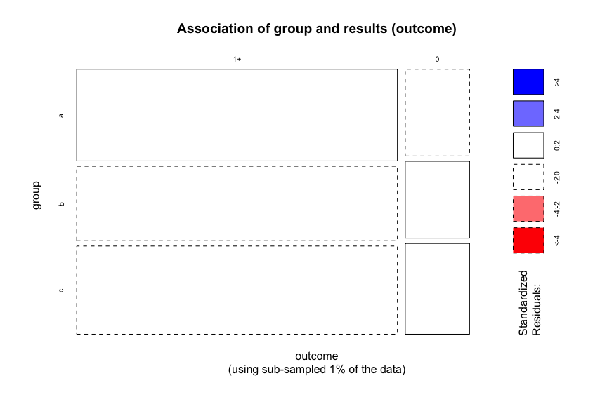

# Initial analysis of second A/B test
Mikhail Popov  
August 21, 2015  


## Data

The dataset was acquired by Mikhail on Friday, **August 21st, at 1:15PM**, holding a morning's worth of data (1,492,744 observations). The data was processed by Mikhail using **magrittr**, **dplyr**, **rgeolocate**, **uaparser**. Statistical analysis is done with certain functions provided by the **mosaic** and **vcd** packages. After the data was processed and filtered, 491,320 observations remained. See **initial_analysis/data_import.R** for more information.


## Exploratory Data Analysis (EDA)


 

There doesn't appear to be a difference in the distributions between the groups. Which is to say, we have no reason to pursue an analysis of locations.

 

Here we see a difference in outcome between the groups. It appears the control group (a) is getting slightly better outcomes than either of the two test groups (b and c). We should also look at a version of the mosaic plot with coloring that corresponds to standardized residuals (observed-expected).

 

What we're seeing is that the control group (slop 0) is getting MORE nonzero results and LESS zero results than expected under independence.

### Sampling Bias Assessments

Next, we take a look at how the sizes of the groups vary between the browsers and operating systems. We expect an even split.

 

 

In general, we see an even split in browsers and operating systems among the test groups. The plot of standardized residuals does not show significant deviations from expected values (under independence), so we are not seeing a bias.

## Statistical Analysis of Association


The test for independence yielided *p*-value < 0.001, which means we see sufficient evidence for association, although that is mostly due to sample size. Rather, it is more important to look at the (standardized) effect size: Cohen's $w$ = 0.043, which is very, very small.

Next, we are going to take a look at the odds ratios, which will provide us with measures of the strength and direction of the associations.


          Odds Ratio   95% CI Lower Bound   Upper Bound
-------  -----------  -------------------  ------------
a vs b          0.94                 0.93          0.96
a vs c          0.78                 0.76          0.79
b vs c          0.82                 0.81          0.84

In all of these the second group was less likely to get non-zero results than the first group (odds ratios and their 95% confidence intervals are less than 1). This is consistent with what we saw in the mosaic plot, where **c** had more zero results than **b** which had more zero results than **a**. But, again, much of this is due to the large sample size.

### Sub-sampling

#### A Priori Power Analysis Performed Post-hoc

Using the power analysis software [G\*Power 3.1](http://www.gpower.hhu.de/en.html), we can calculate that to detect an effect size $w = 0.1$ (considered small) with $\alpha = 0.05$ (probability of [Type 1 error](https://en.wikipedia.org/wiki/Type_I_and_type_II_errors#Type_I_error)), 0.95 power (the ability to detect an effect where there is one), and 2 degrees of freedom (1 - number of groups), we need a sample size of **1545**.

Let us take a quick detour by only looking at a randomly sampled 0.315% of the data (1545 observations).

 

Here we get an effect size of $w = 0.015$, which is also very small but the *p*-value is 0.8377.


          Odds Ratio   95% CI Lower Bound   Upper Bound
-------  -----------  -------------------  ------------
a vs b          0.92                 0.66          1.28
a vs c          0.92                 0.67          1.27
b vs c          1.00                 0.72          1.40

Furthermore, the 95% confidence intervals for the odds ratios now include 1, reflecting the lack of assocation.

### Quotes vs No-quotes


Thursday morning queries do not appear to feature quotes.

### By Project


 

```
##               project  other commons wikidata wikipedia
## group outcome                                          
## a     1+                 553   14868     1611    126519
##       0                  273    1070     2811     22709
## b     1+                1166     787     1744    111125
##       0                 1194      64     4278     17229
## c     1+                1200     884     1832    143844
##       0                 1035     118     6338     28068
```

Interesting! Very, very interesting. By the looks of it, the group sizes vary by project.


                               a      b      c
-------------------------  -----  -----  -----
be_x_old wiki               0.71   0.29   0.00
beta wikiversity            0.00   0.00   1.00
commons                     0.90   0.05   0.06
donation site               0.00   0.00   1.00
foundation wiki             0.30   0.44   0.26
mediawiki                   0.27   0.51   0.22
meta wiki                   0.32   0.43   0.25
office wiki                 0.00   0.00   1.00
outreach wiki                NaN    NaN    NaN
simple wikipedia            0.29   0.33   0.38
simple wiktionary            NaN    NaN    NaN
testwikidata                 NaN    NaN    NaN
wikibooks                   0.29   0.42   0.29
wikidata                    0.24   0.32   0.44
wikimedia                   0.00   0.25   0.75
wikimedia incubator wiki    0.19   0.37   0.44
wikinews                    0.34   0.36   0.30
wikipedia                   0.33   0.29   0.38
wikiquote                   0.39   0.31   0.30
wikisource                  0.28   0.37   0.34
wikispecies                 0.74   0.05   0.21
wikiversity                 0.31   0.51   0.18
wikivoyage                  0.39   0.29   0.32
wiktionary                  0.09   0.46   0.45

 

This is very grim. What we're seeing here is that certain projects (such as Commons) have vastly disproportionate group memberships. We will need to account for this when we perform a final analysis.

### By Language

 

At least languages are okay!

### By Source

 

Here we also see a problem with sampling and the source of the queries.

Let's take a look at the % increase or decrease from 1/3 in the sample sizes.


         api      web
---  -------  -------
a      -4.03    30.79
b     -16.70   -13.63
c      20.73   -17.15

We're seeing -17%, +20%, and even +31% differences in the proportions we observed vs proportions we expect (1/3 for each group) between the sources.

<!-- ### Linear Trend Assessment... -->


## Statistical Analysis of Time Taken

 

Let's see if the time taken means differ between groups. Because the sample size is so huge, we are going to sub-sample it from 490,000 to 1545.


We performed ANOVA and saw no significant difference between the groups in time taken to display results (*p* = 0.203).
